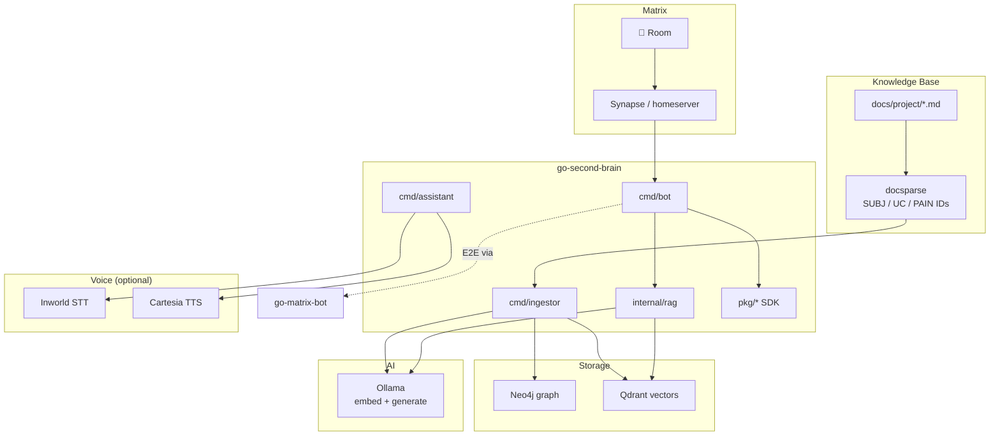
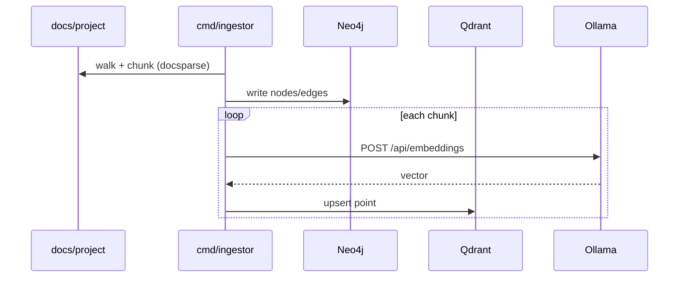
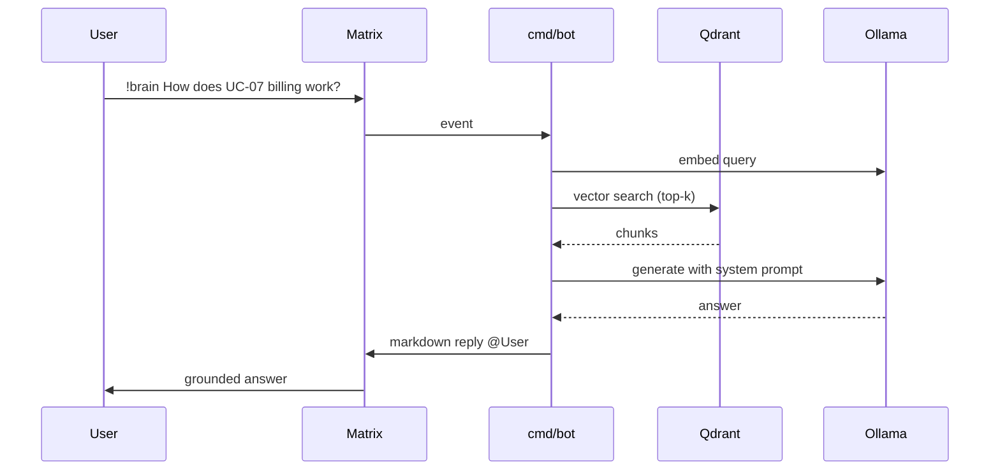
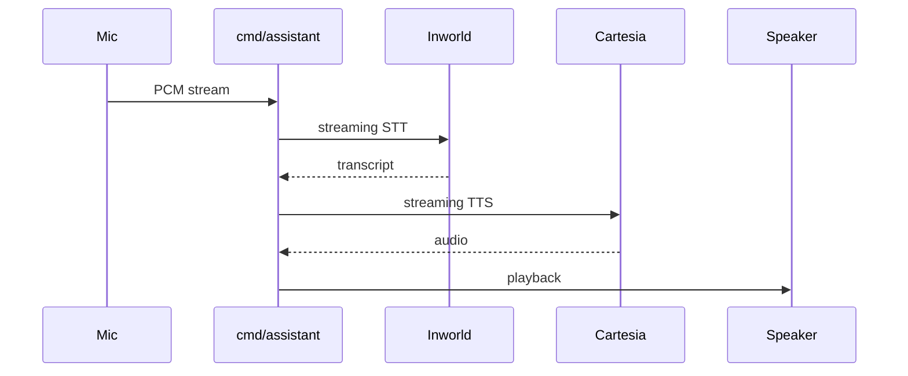
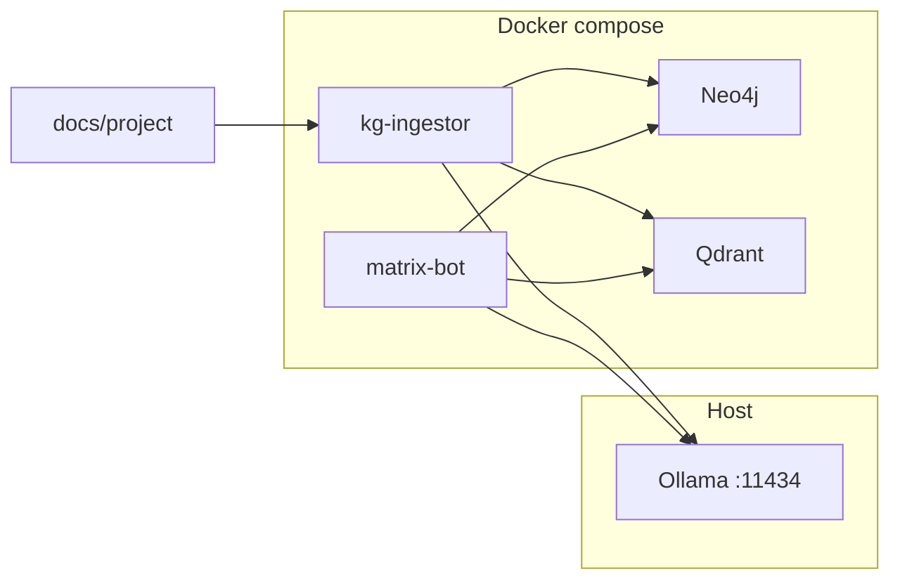

# go-second-brain

[](https://pkg.go.dev/github.com/eSlider/go-second-brain/services)
[](https://opensource.org/licenses/MIT)
[](https://go.dev)
[](https://github.com/eSlider/go-second-brain/releases)
[](https://github.com/eSlider/go-second-brain/stargazers)

Go SDK and reference stack for a self-hosted **second brain**: Markdown knowledge base → **Neo4j** graph + **Qdrant** vectors → **Matrix** RAG bot, with an optional low-latency **voice assistant** (STT/TTS).

Built on [go-matrix-bot](https://github.com/eSlider/go-matrix-bot) for Matrix E2E bots and [go-config](https://github.com/eSlider/go-config) for YAML + env configuration.

Includes a synthetic **DemoCare** demo corpus in [`docs/project/`](docs/project/) for ingest and RAG without real PII.

## Architecture



## Integration Patterns

### Pattern 1 — Ingest Markdown into graph + vectors

One-shot or scheduled indexing of a documentation tree.



### Pattern 2 — Matrix RAG bot

Users ask in a Matrix room; the bot retrieves chunks and generates an answer.



### Pattern 3 — Voice assistant (optional)

Low-latency STT → TTS loop for hands-free use (no RAG in MVP path).



### Pattern 4 — Full stack (compose)



---

## Installation

```bash
go get github.com/eSlider/go-second-brain/services
```

Optional sibling libraries (used by this repo or common in the same stack):

```bash
go get github.com/eslider/go-matrix-bot    # Matrix E2E bot engine
go get github.com/eslider/go-config        # YAML + env config merge
go get github.com/eslider/go-ollama        # standalone Ollama client (alternative)
```

**System dependency** (required for `cmd/bot` / Matrix E2E):

```bash
# Debian/Ubuntu
sudo apt-get install libolm-dev gcc
```

---

## Quick Start

### 1. Clone and configure

```bash
git clone https://github.com/eSlider/go-second-brain.git
cd go-second-brain
cp config.yaml.example config.yaml   # optional overrides
cp .env.example .env                 # secrets: NEO4J_PASSWORD, MATRIX_PASSWORD, …
```

### 2. Run Ollama on the host

```bash
docker run -d -p 11434:11434 -v ollama-data:/root/.ollama ollama/ollama
ollama pull embeddinggemma
ollama pull cajina/gemma4_e2b-q4_k_s:v01
```

Intel GPU acceleration: [ollama-intel-gpu](https://github.com/eSlider/ollama-intel-gpu) — same `OLLAMA_URL`, no code changes.

### 3. Start graph stack + ingest + bot

```bash
make kg-up
make ingest
make bot
```

- Neo4j Browser: http://localhost:7474
- Bot command prefix: `!brain` (`BOT_COMMAND_PREFIX`)
- Agent / SDK docs: [docs/system/README.md](docs/system/README.md)

### 4. Use SDK packages directly

```go
import (
    "context"
    "time"

    "github.com/eSlider/go-second-brain/services/pkg/ollama"
    "github.com/eSlider/go-second-brain/services/pkg/qdrant"
)

ctx := context.Background()
llm, err := ollama.New(ctx, &ollama.Config{URL: "http://127.0.0.1:11434", Timeout: 120 * time.Second})
if err != nil {
    panic(err)
}
defer llm.Close()

vec, err := llm.Embed(ctx, "embeddinggemma", "Pflegegrad Verordnung Abrechnung")
if err != nil {
    panic(err)
}

q, err := qdrant.New(ctx, &qdrant.Config{URL: "http://127.0.0.1:6333", Collection: "knowledge"}, 30*time.Second)
if err != nil {
    panic(err)
}
defer q.Close()

hits, err := q.Search(ctx, "knowledge", vec, 8)
_ = hits
```

### 5. Voice assistant

```bash
cd services
# INWORLD_API_KEY, CARTESIA_API_KEY, CARTESIA_VOICE_ID in .env
go run ./cmd/assistant
```

---

## Public packages (`pkg/`)

| Package | pkg.go.dev | Role |
|---------|------------|------|
| [`pkg/ollama`](https://pkg.go.dev/github.com/eSlider/go-second-brain/services/pkg/ollama) | embeddings + generate | Ollama HTTP client |
| [`pkg/qdrant`](https://pkg.go.dev/github.com/eSlider/go-second-brain/services/pkg/qdrant) | vector CRUD + search | Qdrant REST client |
| [`pkg/neo4j`](https://pkg.go.dev/github.com/eSlider/go-second-brain/services/pkg/neo4j) | driver wrapper | Neo4j connectivity |
| [`pkg/matrix`](https://pkg.go.dev/github.com/eSlider/go-second-brain/services/pkg/matrix) | Matrix config | Homeserver / bot DB settings |
| [`pkg/documents`](https://pkg.go.dev/github.com/eSlider/go-second-brain/services/pkg/documents) | docs root path | Ingestion corpus root |
| [`pkg/inworld`](https://pkg.go.dev/github.com/eSlider/go-second-brain/services/pkg/inworld) | streaming STT | Inworld WebSocket client |
| [`pkg/cartesia`](https://pkg.go.dev/github.com/eSlider/go-second-brain/services/pkg/cartesia) | streaming TTS | Cartesia WebSocket client |
| [`pkg/httpjson`](https://pkg.go.dev/github.com/eSlider/go-second-brain/services/pkg/httpjson) | JSON HTTP helper | Shared HTTP JSON transport |
| [`pkg/botcmd`](https://pkg.go.dev/github.com/eSlider/go-second-brain/services/pkg/botcmd) | command prefix | Bot command settings |

`internal/*` is app wiring (RAG, docsparse, config loader) — not a stability promise for external importers. See [ADR-0003](docs/system/adr/0003-pkg-as-public-sdk-surface.md).

---

## Reference binaries (`cmd/`)

| Binary | Profile | Description |
|--------|---------|-------------|
| [`cmd/ingestor`](services/cmd/ingestor/) | `kg` | Walk `docs/project`, write Neo4j + Qdrant |
| [`cmd/bot`](services/cmd/bot/) | `bot` | Matrix RAG bot via [go-matrix-bot](https://github.com/eSlider/go-matrix-bot) |
| [`cmd/assistant`](services/cmd/assistant/) | — | Low-latency STT/TTS CLI |

---

## Configuration

Defaults in [`config.yaml.example`](config.yaml.example), secrets in [`.env.example`](.env.example). Loaded via [go-config](https://github.com/eSlider/go-config): YAML → `.env` → process env.

| Variable | Required | Component | Description |
|----------|----------|-----------|-------------|
| `NEO4J_URI` | ingest/bot | Neo4j | Bolt URI |
| `NEO4J_USER` | ingest/bot | Neo4j | Username |
| `NEO4J_PASSWORD` | ingest/bot | Neo4j | Password |
| `QDRANT_URL` | ingest/bot | Qdrant | REST base URL |
| `QDRANT_COLLECTION` | ingest/bot | Qdrant | Collection name (default `knowledge`) |
| `OLLAMA_URL` | ingest/bot | Ollama | API base URL |
| `EMBED_MODEL` | ingest/bot | Ollama | Embedding model |
| `GEN_MODEL` | bot | Ollama | Generation model |
| `MATRIX_API_URL` | bot | Matrix | Homeserver URL |
| `MATRIX_USER` | bot | Matrix | Bot localpart |
| `MATRIX_PASSWORD` | bot | Matrix | Bot password |
| `BOT_COMMAND_PREFIX` | bot | Bot | Default `!brain` |
| `INWORLD_API_KEY` | assistant | Inworld | STT API key |
| `CARTESIA_API_KEY` | assistant | Cartesia | TTS API key |
| `CARTESIA_VOICE_ID` | assistant | Cartesia | Voice ID |
| `CONFIG_PATH` | all | Config | Optional path to repo / config file |

Details: [docs/system/configuration.md](docs/system/configuration.md)

---

## Related Libraries

| Library | Description | Install |
|---------|-------------|---------|
| [go-matrix-bot](https://github.com/eSlider/go-matrix-bot) | Matrix bots with E2E encryption | `go get github.com/eslider/go-matrix-bot` |
| [go-config](https://github.com/eSlider/go-config) | YAML / env / JSON config merge | `go get github.com/eslider/go-config` |
| [go-ollama](https://github.com/eSlider/go-ollama) | Ollama + Open WebUI streaming client | `go get github.com/eslider/go-ollama` |
| [ollama-intel-gpu](https://github.com/eSlider/ollama-intel-gpu) | SYCL-accelerated Ollama on Intel GPU | Docker compose stack |

---

## Development

```bash
cd services && go test ./...
make test-integration          # testcontainers (Neo4j, Qdrant)
make lint
```

See [CONTRIBUTING.md](CONTRIBUTING.md).

## License

[MIT](LICENSE)
