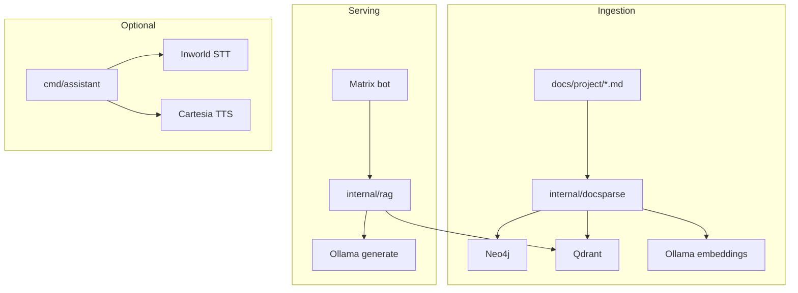

# go-second-brain

[](https://pkg.go.dev/github.com/eSlider/go-second-brain/services)
[](https://opensource.org/licenses/MIT)
[](https://go.dev)

Self-hosted **second brain**: Markdown knowledge base → **Neo4j** graph + **Qdrant** vectors → **Matrix** RAG bot and optional **voice assistant** (STT/TTS).

Includes a synthetic **DemoCare** Pflegedienst corpus in `docs/project/` for ingest and RAG demos without real PII.

## Architecture



## Install

```sh
go get github.com/eSlider/go-second-brain/services
```

## Quick start

```bash
git clone https://github.com/eSlider/go-second-brain.git
cd go-second-brain
cp config.yaml.example config.yaml   # optional local overrides
cp .env.example .env                 # set secrets
make kg-up
make ingest
make bot
```

- **Ollama** runs on the host (`OLLAMA_URL`, default `http://127.0.0.1:11434`)
- **Neo4j Browser:** http://localhost:7474
- **Bot prefix:** `!brain` (see `BOT_COMMAND_PREFIX`)

System docs for agents: [docs/system/README.md](./docs/system/README.md)

## Go module layout

| Path | Description |
|------|-------------|
| `services/pkg/*` | Public SDK clients (Ollama, Qdrant, Neo4j, Matrix, voice APIs) |
| `services/cmd/*` | Reference binaries: ingestor, bot, assistant |
| `services/internal/*` | App wiring (RAG, docsparse, config) |

## Configuration

YAML defaults + env secrets via [go-config](https://github.com/eSlider/go-config):

- `config.yaml.example` — committed defaults
- `.env` — passwords and API keys (gitignored)

Details: [docs/system/configuration.md](./docs/system/configuration.md)

## Voice assistant

```bash
cd services
# set INWORLD_API_KEY, CARTESIA_API_KEY, CARTESIA_VOICE_ID in .env
go run ./cmd/assistant
```

## Development

```bash
cd services && go test ./...
make test-integration    # Docker testcontainers
make lint
```

See [CONTRIBUTING.md](./CONTRIBUTING.md).

## License

MIT — see [LICENSE](./LICENSE).
