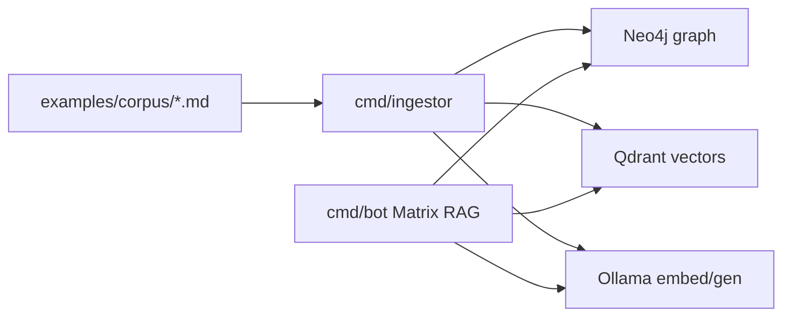

# Architecture

## Repository layout

```
go-second-brain/
├── config.yaml.example   # committed defaults (YAML)
├── .env.example          # secret placeholders
├── compose.yml           # Neo4j, Qdrant, ingestor, Matrix bot
├── docs/
│   └── system/           # SDK docs for agents (this tree)
├── examples/
│   └── corpus/           # tiny synthetic Markdown fixture (tests / smoke ingest)
└── services/
    ├── cmd/              # ingestor, bot, assistant binaries
    ├── pkg/              # public SDK packages
    └── internal/         # app wiring (not importable by consumers)
```

## Data flow



## Public SDK surface (`pkg/`)

| Package | Role |
|---------|------|
| `pkg/ollama` | Embeddings and text generation |
| `pkg/qdrant` | Vector collection CRUD + search |
| `pkg/neo4j` | Driver wrapper |
| `pkg/matrix` | Matrix bot config helpers |
| `pkg/documents` | Docs root path config |
| `pkg/cartesia`, `pkg/inworld` | Voice assistant TTS/STT |
| `pkg/httpclient`, `pkg/httpjson` | HTTP utilities |

Consumers should import **`github.com/eSlider/go-second-brain/services/pkg/...`** only. `internal/*` may change without semver guarantees.

## Configuration

See [configuration.md](./configuration.md). Load order: `config.yaml.example` → `config.yaml` → `.env` → process environment.

## Voice assistant (optional)

`cmd/assistant` — low-latency STT (Inworld) + TTS (Cartesia) loop. Separate from RAG bot; shares config loader.
